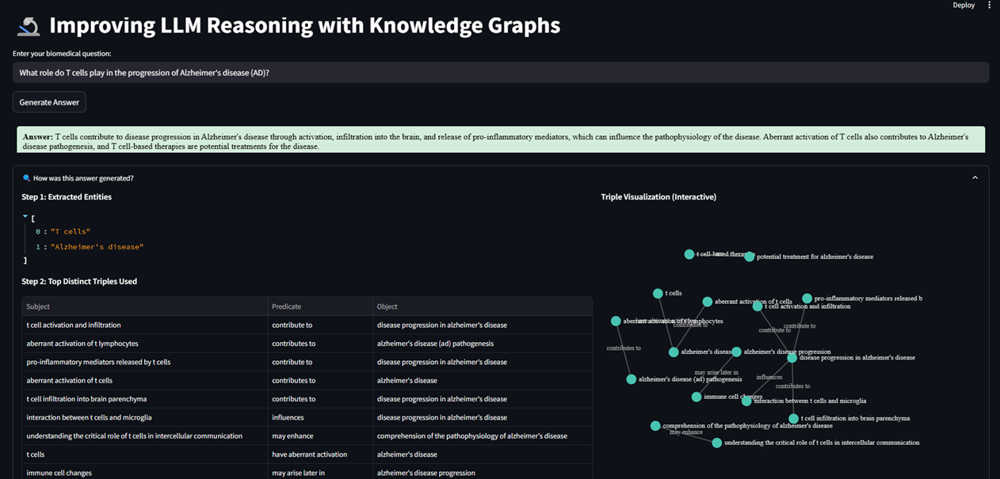
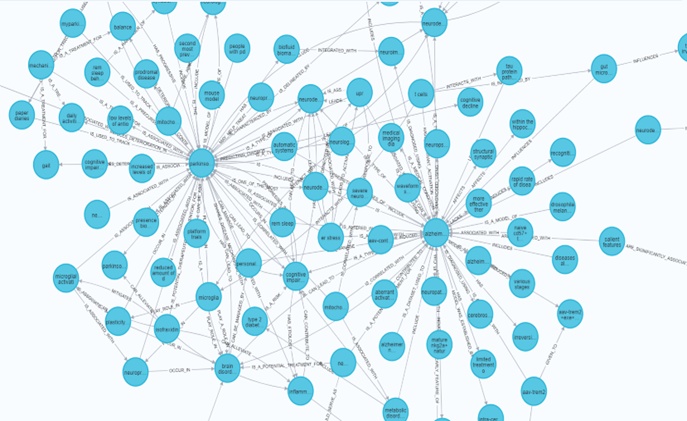

# Ontology-Aware Biomedical Knowledge Graph QA System

[](https://www.python.org/downloads/)
[](https://neo4j.com/)
[](https://github.com/facebookresearch/faiss)
[](https://streamlit.io/)
[](LICENSE)
[](docs/MSLD_2025_Poster.pdf)

> An end-to-end pipeline for interpretable, evidence-based biomedical question answering using knowledge graphs and hybrid retrieval



**🎉 Presented at Midwest Speech and Language Days (MSLD) 2025**

## 🎯 Overview


This system addresses critical limitations in conventional Retrieval-Augmented Generation (RAG) pipelines, including hallucinations, shallow retrieval, and weak factual grounding, by combining  **structured knowledge graphs** with **LLM-based reasoning**. 

**Key Achievement**: Our ontology-integrated pipeline achieves **84% improvement in retrieval quality** (MRR: 0.45 → 0.83+) over vector-based RAG while maintaining **95.5% success rate** across 2,647 biomedical questions.

📊 **[View Poster](docs/MSLD_2025_Poster.pdf)** | 📽️ **[See Presentation](docs/Presentation_Linguistics_knowledgeGraph.pptx)**

---

## 🔬 Problem Statement

Traditional biomedical QA systems face critical challenges:

| Challenge | Impact | Our Solution |
|-----------|--------|--------------|
| 🔴 **Hallucinations** | LLMs generate plausible but incorrect medical information | Graph-grounded evidence chains |
| 🔴 **Shallow Retrieval** | Vector similarity misses implicit relationships | Two-pass extraction + multi-hop traversal |
| 🔴 **Poor Traceability** | No evidence linking answers to sources | Triple-level provenance tracking |
| 🔴 **Limited Reasoning** | Cannot perform multi-hop inference | Ontology-aware graph reasoning |

---

## 🏗️ System Architecture


### Three-Stage Pipeline
```
Stage 1: Triple Extraction          Stage 2: Graph Construction       Stage 3: Hybrid Retrieval
┌──────────────────────┐           ┌───────────────────────┐         ┌─────────────────────┐
│  ExtractTriples.py   │──────────▶│ BuildKnowledgeGraph   │────────▶│   EndPipeline.py    │
│                      │           │     _Neo4j.py         │         │                     │
│  • Primary Extract   │           │                       │         │  • Entity Extract   │
│  • Verification Pass │           │  • Entity Normalize   │         │  • FAISS Search     │
│  • Claude Haiku      │           │  • Build Neo4j Graph  │         │  • Cypher Query     │
│  • Deduplicate       │           │  • Create Indices     │         │  • Rank Triples     │
└──────────────────────┘           └───────────────────────┘         └─────────────────────┘
         │                                    │                               │
         ▼                                    ▼                               ▼
    6,528 triples                      4,813 nodes                    Top-10 Evidence
    (79% improvement)                  5,696 edges                    (MRR 0.83+)
```

### Interactive Demo

Built with **Streamlit**, the demo provides:
- 🔍 Real-time biomedical question answering
- 📊 Interactive knowledge graph visualization
- 🔗 Traceable evidence chains from triples to answers



---

## ⚡ Stage 1: ExtractTriples.py

### Two-Pass Extraction Strategy

Single-pass extraction misses **implicit relationships, cross-sentential dependencies, and coreferences**. Our verification pass recovers these hidden connections.


### Implementation
```python
# ExtractTriples.py - Main extraction logic

import anthropic

def extract_triples_two_pass(text_chunk, client):
    """
    Two-pass triple extraction using Claude Haiku
    
    Args:
        text_chunk: Biomedical text segment
        client: Anthropic API client
        
    Returns:
        List of (subject, predicate, object) triples
    """
    
    # Phase 1: Primary Extraction
    prompt_1 = """
    Extract all subject-predicate-object triples from the text.
    Focus on: genes, proteins, diseases, treatments, chemical compounds,
    cell types, biological processes, statistical indicators.
    
    Handle: appositions, coordinated subjects, negations.
    """
    triples_v1 = client.messages.create(
        model="claude-haiku-20240307",
        messages=[{"role": "user", "content": prompt_1 + f"\n\nText: {text_chunk}"}]
    )
    
    # Phase 2: Verification & Recovery
    entities = extract_entities(triples_v1)
    prompt_2 = f"""
    Given entities: {entities}
    Given existing triples: {triples_v1}
    
    Find ADDITIONAL relationships missed in first pass:
    - Implicit connections
    - Cross-sentential dependencies  
    - Coreference chains (e.g., "it", "this protein")
    - Statistical associations
    - Long-range relationships
    """
    triples_v2 = client.messages.create(
        model="claude-haiku-20240307",
        messages=[{"role": "user", "content": prompt_2 + f"\n\nText: {text_chunk}"}]
    )
    
    # Merge and deduplicate
    all_triples = triples_v1 + triples_v2
    return deduplicate_triples(all_triples)
```

### Results

| Metric | Single-Pass | Two-Pass | Improvement |
|--------|-------------|----------|-------------|
| **Total Triples** | 3,641 | 6,528 | **+79%** |
| **Avg Triples/Chunk** | 7.75 | 13.80 | **+78%** |
| **Avg Triples/Abstract** | 38.73 | 69.45 | **+79%** |
| **Min/Max per Chunk** | 1/32 | 2/46 | Better coverage |

**Output**: `docs/pmid_triples.txt` (6,528 triples)

✅ **Key Insight**: Verification pass captures complex relationships that standard extraction misses, particularly long-range dependencies and implicit causal chains.

---

## 🗄️ Stage 2: BuildKnowledgeGraph_Neo4j.py

### Graph Construction Pipeline

Takes extracted triples and builds a queryable Neo4j knowledge graph with dual indexing (full-text + semantic).
```python
# BuildKnowledgeGraph_Neo4j.py - Main construction logic

from neo4j import GraphDatabase
import spacy

def build_knowledge_graph(triples, neo4j_uri, auth):
    """
    Construct Neo4j graph from triples
    
    Args:
        triples: List of (subject, predicate, object) tuples
        neo4j_uri: Neo4j connection URI
        auth: (username, password) tuple
        
    Returns:
        Graph statistics
    """
    driver = GraphDatabase.driver(neo4j_uri, auth=auth)
    nlp = spacy.load("en_core_web_sm")
    
    # Step 1: Normalize entities
    normalized_triples = []
    for subj, pred, obj in triples:
        subj_norm = normalize_entity(subj, nlp)  # lowercase + lemmatize
        obj_norm = normalize_entity(obj, nlp)
        pred_norm = pred.upper().replace(" ", "_")
        normalized_triples.append((subj_norm, pred_norm, obj_norm))
    
    # Step 2: Create nodes and relationships
    with driver.session() as session:
        for subj, pred, obj in normalized_triples:
            session.run("""
                MERGE (s:Entity {name: $subj})
                MERGE (o:Entity {name: $obj})
                MERGE (s)-[r:%s]->(o)
            """ % pred, subj=subj, obj=obj)
        
        # Step 3: Create full-text index
        session.run("""
            CREATE FULLTEXT INDEX entity_names IF NOT EXISTS
            FOR (n:Entity) ON EACH [n.name]
        """)
    
    driver.close()
    return get_graph_stats(neo4j_uri, auth)
```

### Graph Statistics


- **Nodes**: 4,813 entities
- **Edges**: 5,696 relationships
- **Domains**: 5 disease areas (Alzheimer's, COVID-19, Mental Health, Obesity, Parkinson's)

#### Top Connected Nodes

| Entity | Connections | Significance |
|--------|-------------|--------------|
| **study** | 143 | Central to research abstracts |
| **participants** | 62 | Clinical trial focus |
| **parkinson's disease** | 59 | Domain hub |
| **patients** | 57 | Medical context |
| **alzheimer's disease** | 50 | Domain hub |

#### Most Common Relationships

| Predicate | Count | Example |
|-----------|-------|---------|
| **HAVE** | 128 | `patients HAVE symptoms` |
| **HAS** | 128 | `study HAS participants` |
| **IS** | 116 | `protein IS transcription_factor` |
| **IS_ASSOCIATED_WITH** | 108 | `gene IS_ASSOCIATED_WITH alzheimer's` |
| **INCLUDE** | 101 | `symptoms INCLUDE memory_loss` |

---

## 🔍 Stage 3: EndPipeline.py

### Hybrid Retrieval System

Combines **symbolic** (graph) and **semantic** (vector) approaches for optimal retrieval.


### Implementation
```python
# EndPipeline.py - Main retrieval logic

import faiss
from sentence_transformers import SentenceTransformer
from neo4j import GraphDatabase
import anthropic

class HybridRetriever:
    def __init__(self, neo4j_uri, auth, faiss_index_path):
        self.driver = GraphDatabase.driver(neo4j_uri, auth=auth)
        self.embedder = SentenceTransformer('all-roberta-large-v1')
        self.faiss_index = faiss.read_index(faiss_index_path)
        self.claude = anthropic.Anthropic()
        
    def retrieve(self, question, top_k=10):
        """
        Hybrid retrieval: FAISS + Neo4j Cypher
        
        Args:
            question: User's biomedical question
            top_k: Number of triples to retrieve
            
        Returns:
            List of top-k relevant triples
        """
        # Step 1: Extract entities using Claude
        entities = self.extract_entities(question)
        
        # Step 2: Query Neo4j (exact lexical match)
        with self.driver.session() as session:
            result = session.run("""
                MATCH (e:Entity)
                WHERE e.name IN $entities
                RETURN e.name AS entity
            """, entities=entities)
            matched_entities = [r["entity"] for r in result]
        
        # Step 3: If no exact match, use FAISS semantic search
        if not matched_entities:
            query_embedding = self.embedder.encode([question])[0]
            distances, indices = self.faiss_index.search(
                query_embedding.reshape(1, -1), k=5
            )
            matched_entities = [self.entity_names[idx] for idx in indices[0]]
        
        # Step 4: Retrieve 1-hop subgraph from Neo4j
        with self.driver.session() as session:
            result = session.run("""
                MATCH (s:Entity)-[r]->(o:Entity)
                WHERE s.name IN $entities
                RETURN s.name AS subject, 
                       type(r) AS predicate, 
                       o.name AS object
                LIMIT 100
            """, entities=matched_entities)
            candidate_triples = [(r["subject"], r["predicate"], r["object"]) 
                                for r in result]
        
        # Step 5: Rank triples by semantic similarity to question
        triple_texts = [f"{s} {p} {o}" for s, p, o in candidate_triples]
        triple_embeddings = self.embedder.encode(triple_texts)
        question_embedding = self.embedder.encode([question])[0]
        
        similarities = cosine_similarity(
            question_embedding.reshape(1, -1), 
            triple_embeddings
        )[0]
        
        # Return top-k triples
        top_indices = similarities.argsort()[-top_k:][::-1]
        return [candidate_triples[i] for i in top_indices]
    
    def extract_entities(self, question):
        """Extract biomedical entities using Claude"""
        response = self.claude.messages.create(
            model="claude-3-haiku-20240307",
            messages=[{
                "role": "user",
                "content": f"Extract biomedical entities: {question}"
            }]
        )
        return parse_entities(response.content[0].text)
```

### Retrieval Architecture

| Phase | What Happens |
|-------|--------------|
| **Offline** | • Embed all entity names using all-roberta-large-v1<br>• Build FAISS index (entity_index.faiss)<br>• Create Neo4j full-text index |
| **Online** | • Extract entities using Claude<br>• Query Neo4j for exact matches<br>• If missing, expand via FAISS similarity<br>• Retrieve 1-hop subgraph with Cypher<br>• Rank triples by question similarity |

---

## 📊 Performance Metrics

### Retrieval Quality


| Metric | Baseline RAG | Graph-RAG | Improvement |
|--------|--------------|-----------|-------------|
| **MRR** | 0.45 | **0.83+** | **+84%** |
| **Doc-Recall@10** | — | **93%+** | — |
| **Chunk-Recall@10 (Relaxed)** | — | **91%+** | — |
| **Success Rate** | — | **95.5%** | (2,527 QA pairs) |

### Answer Fidelity

Evaluation data: `docs/qa_evaluation.json` (2,527 questions)  
Ground truth: `docs/qa_ground_truth.json`

| Metric | Score | Interpretation |
|--------|-------|----------------|
| **BLEU** | 0.267 | Paraphrasing (not verbatim copying) |
| **ROUGE-L** | 0.438 | Moderate lexical overlap |
| **Cosine Similarity** | **0.609** | Strong semantic alignment |
| **High Fidelity (≥0.9)** | **31%** (794 answers) | Excellent |
| **Medium Fidelity (0.5-0.9)** | **35%** (893 answers) | Good |
| **Low Fidelity (<0.5)** | **33%** (840 answers) | Needs improvement |

✅ **Key Finding**: System prioritizes **semantic correctness** over **lexical matching**, which is appropriate for biomedical QA where paraphrasing is common.

---

## 📦 Dataset

### Benchmark Overview

- **Abstracts**: 95 biomedical research papers
- **Chunks**: 470+ overlapping segments
- **Questions**: 2,527 curated QA pairs
- **Domains**: 5 disease areas
- **Ground Truth**: Generated using Claude with strict grounding rules

### Disease Domain Distribution

| Domain | Questions | Focus |
|--------|-----------|-------|
| Alzheimer's Disease | ~500 | Neurodegeneration, tau protein |
| COVID-19 | ~500 | Viral pathology, vaccines |
| Mental Health | ~500 | Depression, anxiety, therapies |
| Obesity | ~500 | Metabolism, interventions |
| Parkinson's Disease | ~527 | Motor symptoms, dopamine |

---

## 🚀 Installation & Usage

### Prerequisites
```bash
Python 3.8+
Neo4j 5.0+
Anthropic API Key (for Claude)
```

### Quick Start
```bash
# Clone repository
git clone https://github.com/theyaneshj17/knowledgeGraph.git
cd knowledgeGraph

# Install dependencies
pip install -r requirements.txt

# Set environment variables
export NEO4J_URI="bolt://localhost:7687"
export NEO4J_USER="neo4j"
export NEO4J_PASSWORD="your_password"
export ANTHROPIC_API_KEY="your_api_key"

# Run pipeline
python ExtractTriples.py --input data/abstracts --output data/triples
python BuildKnowledgeGraph_Neo4j.py --triples data/triples
python EndPipeline.py --question "What causes Alzheimer's disease?"
```

### Launch Streamlit Demo
```bash
streamlit run app.py
```

Navigate to `http://localhost:8501` to interact with the system.

---

## 📁 Project Structure
```
knowledgeGraph/
├── ExtractTriples.py              # Stage 1: Two-pass triple extraction
├── BuildKnowledgeGraph_Neo4j.py   # Stage 2: Neo4j graph construction
├── EndPipeline.py                 # Stage 3: Hybrid retrieval system
├── app.py                         # Streamlit demo interface
├── Triples2.ipynb                 # Triple extraction notebook
├── Validation.ipynb               # Evaluation notebook
├── groundtruthgenerate.ipynb      # Ground truth generation
├── docs/
│   ├── images/                    # Visualization assets
│   │   ├── demo_interface.png
│   │   ├── pipeline_architecture.png
│   │   ├── extraction_comparison.png
│   │   ├── hybrid_retrieval_diagram.png
│   │   ├── retrieval_metrics.png
│   │   └── knowledge_graph_viz.png
│   ├── MSLD_2025_Poster.pdf       # Conference poster
│   ├── Paper_KnowledgeGraph.pdf   # Full research paper
│   ├── Presentation_Linguistics_knowledgeGraph.pptx
│   ├── pmid_triples.txt           # Extracted triples (6,528)
│   ├── qa_evaluation.json         # Evaluation results
│   └── qa_ground_truth.json       # Ground truth answers
├── requirements.txt
├── .env.example
└── README.md
```

---

## 🔬 Technical Stack

### Models

| Component | Model | Purpose |
|-----------|-------|---------|
| **Triple Extraction** | Claude Haiku | Two-pass extraction |
| **Baseline Embeddings** | all-MiniLM-L6-v2 (BERT) | Vector RAG baseline |
| **Graph Embeddings** | all-roberta-large-v1 (RoBERTa) | FAISS indexing |
| **Answer Generation** | Claude | Graph-grounded QA |
| **Entity Recognition** | Claude | Query parsing |

### Technologies

- **Graph Database**: Neo4j 5.0+
- **Vector Search**: FAISS
- **Embeddings**: SentenceTransformers
- **LLM API**: Anthropic Claude
- **Backend**: Python 3.8+
- **Frontend**: Streamlit
- **NLP**: spaCy

---

## 📈 Evaluation

Run full evaluation pipeline:
```bash
# Evaluate extraction quality
python evaluate_extraction.py --compare single-pass two-pass

# Evaluate retrieval performance
python evaluate_retrieval.py --qa-data docs/qa_ground_truth.json

# Evaluate answer fidelity
python evaluate_answers.py --predictions outputs/predictions.json
```

Results will be saved to `results/` directory with detailed metrics.

---

## 🎯 Key Results Summary

✅ **79% more triples** extracted with two-pass strategy (6,528 vs 3,641)  
✅ **84% MRR improvement** over baseline vector RAG (0.45 → 0.83+)  
✅ **93%+ document recall** with hybrid retrieval  
✅ **95.5% success rate** on 2,647 biomedical questions  
✅ **0.61 semantic fidelity** for generated answers  
✅ **Presented at MSLD 2025** (Midwest Speech and Language Days)

---

## 🛣️ Future Work

- [ ] **Multi-hop reasoning**: Extend to 2-3 hop graph traversal
- [ ] **Ontology integration**: Incorporate UMLS, MeSH for entity normalization
- [ ] **Real-time updates**: Incremental graph updates from new papers
- [ ] **Explainability UI**: Enhanced visualization of reasoning paths
- [ ] **Multi-modal support**: Integrate figure/table extraction
- [ ] **Scaling**: Expand to 100K+ PubMed articles

---


## 📄 License

This project is licensed under the MIT License - see [LICENSE](LICENSE) file for details.

---

## 🙏 Acknowledgments

- **Neo4j** for graph database infrastructure
- **Anthropic** for Claude API access
- **Facebook AI** for FAISS vector search
- **HuggingFace** for SentenceTransformers
- **PubMed** for biomedical literature access
- **MSLD 2025** for conference presentation opportunity

---


<p align="center">
  <i>Built with ❤️ for advancing biomedical research through AI</i>
</p>

<p align="center">
  <b>🎉 Presented at Midwest Speech and Language Days (MSLD) 2025</b>
</p>